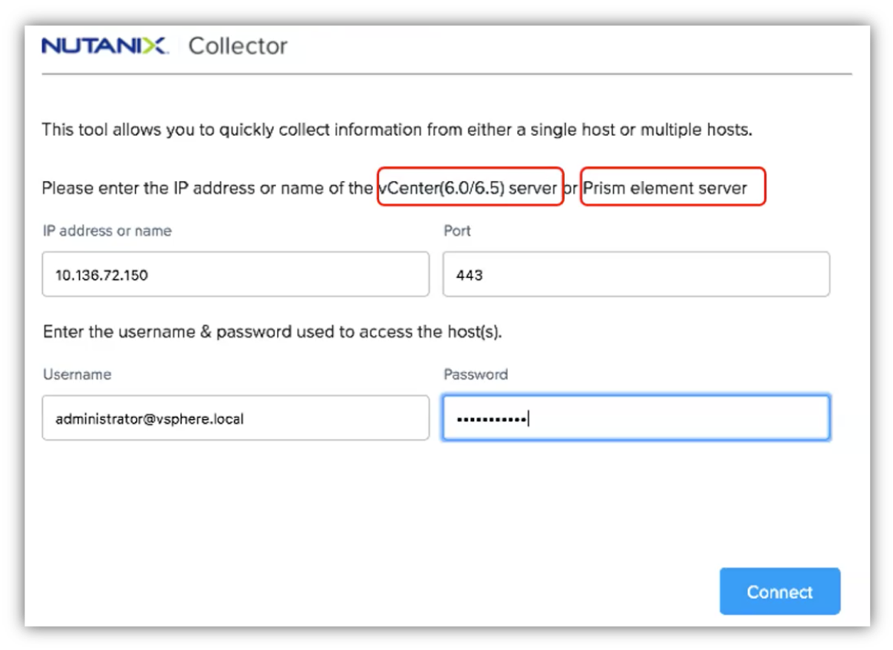

.. _collector:

---------------------
What is Nutanix Collector
---------------------

Nutanix Collector collects server virtualization workload details from customers existing datacenters.
Once connected to customer’s hosts or vCenter, the tool collects information such as number of VMs, its power on/off state, VMs configuration which includes number of cores, RAM and allocated and used capacity.
The user gets an option to save the data in excel format.
Currently, as an alternative to RVTools, the Collector output can be imported into Sizer for sizing.
The tool requires host/vCenter IP and user credentials to login and connect.

-------------
Installing and Running Nutanix Collector
-------------

Perform the following procedure to download and install the Nutanix Collector desktop application.

1. On the Nutanix portal, go to Downloads > Tools & Firmware to download the Nutanix Collector desktop application package. https://portal.nutanix.com/#/page/static/supportTools
2. Unzip the package in a folder of your choice on your local computer.
3. Go to the folder where you have saved the package and click the package to launch the application.

Overview
++++++++

Instructions to use data collected with Nutanix Collector to size a Nutanix platform.

Running Collector and Exporting Results
+++++++++++++++++++++++++++++++++++++

Use the following steps to run Nutanix Collector, and export the results:

To initialize data collection from your VMware clusters or Nutanix Clusters, you must connect to vCenter Server (or each ESX host),Prism Element PE or Prism Central PC. After Nutanix Collector establishes a connection, data collection is initialized. Nutanix Collector generates the output files in the Excel format after the data collection is complete.

Nutanix Collector enables you to collect information from either of the following.
• A single entity (datacenter or cluster) or all the entities registered to a vCenter Server.
• Prism Central or a cluster.
Perform the following procedure to connect to vCenter Server and initialize data collection.

Launch the application

Do the following in the Home screen.
A. In the IP address or name field, do one of the following.
» Type the IP address or host name of vCenter Server if you want to collect information from all the hosts in the ESXi cluster.
» Type the IP address or host name of the single host from which you want to collect information.
» Type the IP address or host name of the cluster from which you want to collect information.
» Type the IP address or host name of the Prism Central from which you want to collect information.
B. In the Port field, type the port number of vCenter Server or the single ESXi host or the Prism instance (Prism Central or Prism Element).

.. note::
    The Port field is populated by default with the port number 443. If the port number is different in your setup, you can change the port number.

C. In the Username field, type the user name of the user account that you want Nutanix Collector to use to access vCenter Server or a single ESXi host Prism instance (Prism Central or Prism Element).
D. In the Password field, type the password of the user account you specified in the preceding step.
E. Click Connect.

- Collector will collect all of you virtual environment information and display it as a table

.. figure:: images/rvtools_05.png

- Export the result as Excel format: File > Export all to Excel

.. figure:: images/rvtools_06.png

- Provide a folder and a name for the file

.. figure:: images/rvtools_07.png

Getting the Numbers for Sizer
+++++++++++++++++++++++++++++

Now lets get the VM information we need from RVTools, and see where that information goes in Sizer.

Getting the number of VMs
.........................

On tab tabvInfo in RVTools Excel extract, column A list the name of VMs. Select all the VMs and get the number as indicated in « Count » in the Excel footer:

.. figure:: images/rvtools_08.png

In the Sizer, provide the number of VMs:

.. figure:: images/rvtools_09.png

Getting the VM’s average vCPU and Memory
........................................

We need to get the average vCPU and RAM per VM from the tabvInfo tab. Below you can see we sum up the vCPU of the VMs (M column) and divide it by the number of VMs. Same thing for the Memory (N column).

.. figure:: images/rvtools_10.png

In the Sizer, provide the average vCPU and RAM values:

.. figure:: images/rvtools_11.png

Get the storage used
....................

In tabvPartition tab, add a column named Used Capacity after Free MB (F column). Add a formula to subtract Free MB (F) to Capacity MB (E). In the example below:=E2-F2 (Repeat that formula until the last line).

.. figure:: images/rvtools_12.png

Sum up the new Used Capacity column:

.. figure:: images/rvtools_13.png

Divide the sum Used Capacity (27 155 568 MB in this example) by the number of VMs (181 VMs here). The average storage per VM here is 150,03 GB.

In the Sizer, provide the quantity of storage in GiB* (140GiB).

Split the storage amount between Cold Data and Hot Data (Based on DPACK results or a ratio, like 10% Hot/Cold)

.. figure:: images/rvtools_14.png

.. note:: You can use Google to convert GigaByte to GibiByte

  .. figure:: images/rvtools_15.png

Takeaways
+++++++++

- RVTools can be very useful to capture the information we need to size Nutanix workloads.
